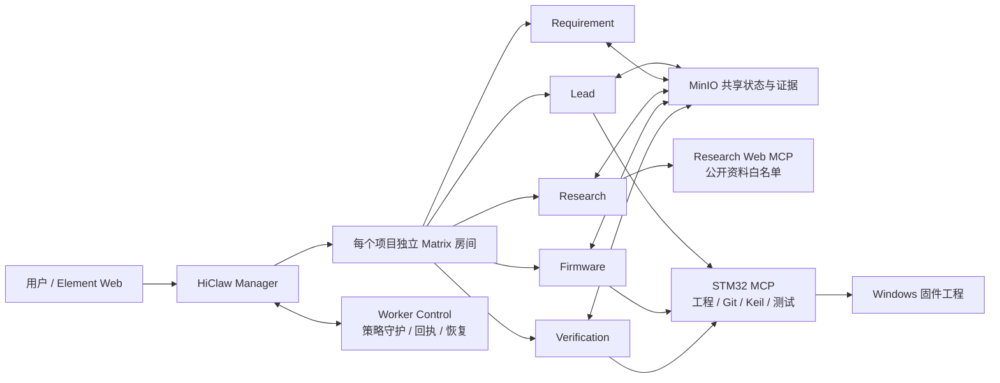

# MCUForge——面向单片机研发的多 Agent 工程协作基座

MCUForge 基于 HiClaw/AgentTeams，把单片机开发拆成需求、资料、固件、验证和协调五类职责。用户只需描述目标，系统会先形成可修改的工程草案，明确确认后才进入合同冻结、资料检索、补丁提案、真实构建和证据归档。它解决的不是“让 AI 多写一些代码”，而是让 AI 按工程流程安全地接手已有 MCU 项目。

当前仓库同时包含：

- 可复用的 MCUForge Agent Infra；
- 一套可以真实运行的 VCW 开发板 Demo；
- 一键环境检查、依赖安装、启动、验收与交付打包脚本；
- 面向下一位维护者的完整中文接手说明。

> 新维护者先读 [接手总手册](docs/HANDOFF.md)。比赛评审或复现人员直接按下方「部署指南」操作即可。

## 部署指南（全新电脑 / 全新 HiClaw 环境）

**前置条件**：Windows 10/11、PowerShell 7（`pwsh`）、Git、Docker Desktop（已启动）、Node.js 20+，并且已按 [HiClaw 官方文档](https://github.com/agentscope-ai/HiClaw) 完成本机部署（`docker inspect -f '{{.State.Running}}' hiclaw-controller` 应输出 `true`）且已配置自己的模型 API Key。

### 1. 获取代码

```powershell
git clone https://github.com/Asuka-WILLE/MCUForge.git
Set-Location .\MCUForge
```

> 请部署到工作盘根目录（如 `C:\MCUForge`）的普通文件夹，**不要**放在 `C:\Windows\System32`。

### 2. 准备 Worker 镜像（新机器必做，否则第 5 步报缺镜像）

mcuforge 的五个 Worker 依赖两个本地镜像，它们不随 GitHub 分发，需在本机构建或离线导入：

```text
local/mcuforge-hiclaw-worker:policy-safe-20260902-v2   # HiClaw 官方 hiclaw-worker + 策略安全层
local/mcuforge-worker-control:20260902                 # 内网 Worker 可靠性守护桥
```

**联网自动构建（推荐）**——构建源已提交在仓库内：

```powershell
pwsh -NoProfile -ExecutionPolicy Bypass -File `
  .\agent_infra\hiclaw\worker-image-policy-safe\Build-MCUForgeWorkerImage.ps1
```

首次会自动拉取官方 `hiclaw-worker` 基础镜像（约 2–4 GB，阿里云中国区镜像）与 `python:3.12-alpine`；若你的 HiClaw 使用其它区域 registry，用 `-BaseImage <你的 hiclaw-worker 镜像>` 覆盖后重跑。

**离线导入**（维护者用 `agent_infra/hiclaw/Export-MCUForgeImages.ps1` 导出交付 tar.gz 时）：

```powershell
docker load -i .\mcuforge-hiclaw-images.tar.gz
docker images    # 应能看到上面两个 local/mcuforge-* 镜像
```

### 3. 环境检查

```powershell
pwsh -NoProfile -ExecutionPolicy Bypass -File .\Check-MCUForgeEnvironment.ps1
```

- 全部"必需=是"项须通过；`MCUForge Worker 镜像 / Worker Control 镜像` 两项缺失时按 Fix 提示回到第 2 步。
- HiClaw 环境文件必须指向**本机安装生成的** `hiclaw-manager.env`（不在默认位置时加 `-HiClawEnvPath <路径>`），不要复制他人的密钥文件。

### 4. 安装依赖

```powershell
pwsh -NoProfile -ExecutionPolicy Bypass -File .\Install-MCUForge.ps1
```

在两个 Bridge 目录执行锁定安装与 TypeScript 构建（首次需访问 npm registry）。

### 5. 一键启动

```powershell
pwsh -NoProfile -ExecutionPolicy Bypass -File .\Start-MCUForge.ps1
```

**首次启动会自动完成引导**：先注册 `mcuforge` Team/Worker（HiClaw 网关随之生成各 Worker 的访问凭据），再注册 STM32 / Research 两个 MCP Bridge，最后打开 Element Web——无需在网关控制台手工创建 consumer。已部署过的环境检测到 Team 就绪会自动跳过重复引导。

### 6. 验收

```powershell
pwsh -NoProfile -ExecutionPolicy Bypass -File .\Test-MCUForge.ps1 -Mode Live
docker exec hiclaw-controller hiclaw get teams mcuforge          # Active
docker exec hiclaw-controller hiclaw get workers --team mcuforge # 5 个 Worker ready
Invoke-RestMethod http://127.0.0.1:8765/health                   # status ok（STM32 Bridge）
Invoke-RestMethod http://127.0.0.1:8766/health                   # status ok（Research Bridge）
```

浏览器打开 `http://127.0.0.1:18088`（Element Web）即可用自然语言发起任务（见「怎么发起一次任务」）。

### 日常启动 / 更新

- 已成功部署过的机器再次启动只需执行第 5 步，不会丢失任何团队、任务或证据数据。
- 代码更新：`git pull origin main` 后重新执行第 5 步即可。

### 常见首启报错

| 报错 | 原因 | 处理 |
| --- | --- | --- |
| 找不到 `worker-image-policy-safe\Build-…ps1` | 代码版本过旧 | `git pull origin main`（应 ≥ `3827c25`） |
| `Worker image not found: local/mcuforge-hiclaw-worker:…` | 镜像未构建/未导入 | 回到第 2 步 |
| `Required Higress consumers are missing: …` | 使用了不含首启修复的旧代码 | 更新代码后重跑第 5 步（会自动引导并等待生成，默认最多 120 秒） |
| `找不到 HiClaw 环境文件 …/hiclaw-manager.env` | 路径不对或安装未完成 | 显式传 `-HiClawEnvPath`；详见排障手册 6.1 |
| `SecurityError: … not digitally signed`（ExecutionPolicy 拦截） | 运行脚本漏了执行策略参数 | 一律用 `pwsh -NoProfile -ExecutionPolicy Bypass -File <脚本>`；或执行一次 `Set-ExecutionPolicy -Scope CurrentUser RemoteSigned` |
| 直接输入 `local/mcuforge-hiclaw-worker:policy-safe-…` 报 `CommandNotFoundException` | 镜像名不是可执行命令 | 检查镜像用 `docker images`，精确判断用 `docker image inspect <镜像名>` |
| `request returned 500 Internal Server Error …/containers/hiclaw-controller/json`（出现在 Bootstrap 期间） | Docker 引擎瞬时繁忙，但 Team 可能已创建 | 等 30 秒 → `docker ps` 确认容器 Up → `docker exec hiclaw-controller hiclaw get teams mcuforge` 看到 `Phase: Active`、`ReadyWorkers: 4/4` 后重跑第 5 步（Bootstrap 幂等，不会重复建团队） |

### Git 连不上 GitHub（clone / pull / push）

| 现象 | 原因 | 处理 |
| --- | --- | --- |
| `https … Recv failure: Connection was reset` | 网络对大包不稳 | `git config --global http.postBuffer 524288000` 后重试；或改用 SSH |
| `Permission denied (publickey)` | 本机未配置 GitHub SSH key | 生成密钥：`ssh-keygen -t ed25519 -C "你的邮箱"`，把 `~\.ssh\id_ed25519.pub` 内容粘贴到 GitHub → Settings → SSH and GPG keys → New SSH key；再 `ssh -T git@github.com` 验证 |
| 仓库提示找不到 / 拉下来缺文件 | clone 到了错误仓库 | 交付仓库为 `https://github.com/Asuka-WILLE/MCUForge.git` |

详细步骤、预期输出与更多故障处理见 [运行与排障手册](docs/OPERATIONS.md) 与 [HiClaw 细节手册](agent_infra/hiclaw/README.md)。

---

## 快速启动（已就绪环境）

前提：镜像已就绪、mcuforge Team 已部署过。日常只需：

```powershell
git clone https://github.com/Asuka-WILLE/MCUForge.git
Set-Location .\MCUForge

pwsh -NoProfile -ExecutionPolicy Bypass -File .\Start-MCUForge.ps1
```

启动脚本会恢复 Docker/HiClaw、启动两个本机 Bridge、注册 MCP、同步 Skills 和角色规则，并打开 Element Web。然后执行只读运行态验收：

```powershell
pwsh -NoProfile -ExecutionPolicy Bypass -File .\Test-MCUForge.ps1 -Mode Live
```

要真实检查 Manager 与 Worker 的消息链路：

```powershell
pwsh -NoProfile -ExecutionPolicy Bypass -File .\Test-MCUForge.ps1 -Mode Full -CoordinationRounds 1
```

`Full` 会向 Matrix 发送协调验收消息；普通代码检查使用默认的 `Static` 即可。

## 它解决什么问题

传统 AI 辅助 MCU 开发常见以下失败模式：

1. 误解需求后直接修改源码，甚至越过用户边界。
2. 小改动反复跑昂贵测试，大问题却没有独立复测。
3. 把逻辑堆进 `main.c`，缺少模块、接口和回归意识。
4. 每轮重新阅读手册，来源、版本和结论没有沉淀。
5. 长任务没有阶段汇报，用户不知道 Agent 是在工作、等待还是卡死。
6. 把“已生成补丁”误报成“已落地”，把静态检查误报成真实构建或硬件通过。
7. Worker 显示在线但消息链路已经失效，Manager 一直等到心跳才发现。

MCUForge 用需求确认门、角色分工、共享状态、受控 MCP、补丁白名单、独立验证、实时进度和自动恢复机制逐项处理这些问题。

## 架构一览



核心原则：Matrix 保存可读协作轨迹，MinIO 保存结构化任务状态与证据，MCP 只开放白名单能力，Windows 工程仍是源码事实源。完整说明见 [系统架构](docs/ARCHITECTURE.md)。

## 五个 Agent 的职责

| 角色 | 主要输入 | 主要输出 | 决策边界 |
| --- | --- | --- | --- |
| Lead | 用户确认的执行草案、各角色结果 | 任务拆解、交接、最终汇总 | 不代替 Firmware 写实现，不代替 Verification 判定通过 |
| Requirement | 自然语言需求、项目边界 | 冻结验收合同 | 合同未确认不得放行编码 |
| Research | 合同、芯片/器件问题 | 带版本、来源、许可证和置信度的事实卡片 | 只能访问允许的公开 HTTPS 来源 |
| Firmware | 冻结合同、可信事实、工程快照 | 模块化设计与统一 diff 提案 | 不直接写主机源码，不烧录、不推送 |
| Verification | 合同、实际 diff、固定测试、构建入口 | 独立验证结论与证据 | 不替实现角色改代码，不把缺证据写成通过 |

Manager 不是第六个实现角色。它负责项目房间、成员、任务路由、状态汇总与 Worker 可靠性恢复。

## 怎么发起一次任务

1. 在 Element Web 打开 `Manager: default` 私聊。
2. 用自然语言说“请创建一个新项目……”。
3. Manager 自动创建 `Project: <名称>` 房间并拉入全部角色。
4. 此后只在项目房间交流，不要分散到 Worker 私聊。
5. Leader 先返回 `INTAKE_DRAFT`；你可以继续修改。
6. 只有回复“可以了，开始执行”或“确认执行”才会正式派工。

示例输入见 [examples/requests/create-project.txt](examples/requests/create-project.txt) 和 [examples/requests/change-request.txt](examples/requests/change-request.txt)。

## 仓库结构

```text
MCUForge/
├── Check-MCUForgeEnvironment.ps1   # 检查，不修改运行环境
├── Install-MCUForge.ps1            # 安装两个 Node Bridge 的锁定依赖并构建
├── Start-MCUForge.ps1              # 根目录一键启动入口
├── Test-MCUForge.ps1               # Static / Live / Full 三层验收
├── Build-MCUForgePackage.ps1       # 从已提交 HEAD 生成干净 ZIP 和 SHA-256
├── config/                          # 不含密钥的示例配置
├── docs/                            # 接手、架构、比赛、运维、开发说明
├── examples/                        # 示例输入与预期输出
├── agent_infra/
│   ├── hiclaw/                      # Team、项目房间、可靠性控制与验收脚本
│   │   └── worker-image-policy-safe/  # Worker 镜像构建源 + Build/Export 脚本
│   ├── tool_bridge/                 # STM32 MCP 与 Research MCP
│   ├── skills/                      # 可复用工程 Skill
│   └── patch_channel/               # 受控补丁登记与应用
└── demos/
    └── vcw-board-demo/
        ├── firmware/                # STM32/Keil 工程、PC 工具和固定测试
        └── agent_profile/           # 合同、角色、来源、哈希和补丁策略
```

`agent_infra` 是产品本体，`demos/vcw-board-demo` 是验证该基座的示例。测试、固件和项目合同都属于 Demo，不应塞进 Infra。

## 安全边界

- 默认不直接修改 Windows 源码：Firmware 先创建补丁提案，由受控工具复核后应用。
- 路径白名单、HEAD、源码哈希、补丁哈希和固定测试哈希必须一致。
- 默认不开放任意 Shell、Git push、烧录或 COM 口工具。
- `AUTO_LOCAL` 只允许本次本地补丁应用、构建和固定测试；不等于烧录或推送授权。
- 密钥只放在使用者自己的 `hiclaw-manager.env` 或 HiClaw 安全存储中，绝不提交到仓库或发到房间。
- 所有“通过”结论必须说明证据层级：静态检查、构建、集成、硬件测试不能混为一谈。

## 文档导航

- [接手总手册](docs/HANDOFF.md)：第一次接手时按顺序读。
- [比赛要求与作品映射](docs/COMPETITION.md)：赛道、评分点、提交物和当前覆盖情况。
- [系统架构](docs/ARCHITECTURE.md)：组件、数据流、状态机、权限与可靠性机制。
- [运行与排障手册](docs/OPERATIONS.md)：安装、启动、验收、日志和常见故障。
- [二次开发指南](docs/DEVELOPMENT.md)：换项目、改角色、加 Skill/MCP、测试和 Git 流程。
- [当前验证证据](docs/VALIDATION.md)：本次交付实际执行过什么、哪些尚未验证。
- [HiClaw 细节手册](agent_infra/hiclaw/README.md)：现有脚本参数与底层操作。

## 比赛定位

本项目参加世界人工智能开源大赛“Agent Infra 新智基座”赛道。作品重点不是单个模型的代码生成能力，而是多 Agent 在复杂约束下完成任务拆解、上下文传递、工具调用、结果验证、执行证据、安全审计和异常恢复的完整闭环。官方要求与项目逐项映射见 [docs/COMPETITION.md](docs/COMPETITION.md)。

## 生成干净代码包

完成提交后执行：

```powershell
pwsh -NoProfile -ExecutionPolicy Bypass -File .\Build-MCUForgePackage.ps1
```

脚本只打包当前 Git `HEAD`，不会把密钥、`node_modules`、构建缓存、本地运行状态或未提交文件装进 ZIP，并同时生成 SHA-256 文件。GitHub 的 “Download ZIP” 也是可执行代码包；本脚本用于比赛平台需要单独上传 ZIP 的场景。

## License

除另有声明的文件或目录外，本仓库原创代码与已获授权的 VCW Demo 内容按 [Apache License 2.0](LICENSE) 发布。Arm CMSIS、STM32 HAL、STM32 USB Device Library 等第三方组件继续适用各自目录内的许可证；详见 [THIRD-PARTY-NOTICES.md](THIRD-PARTY-NOTICES.md) 与 [NOTICE.md](NOTICE.md)。
