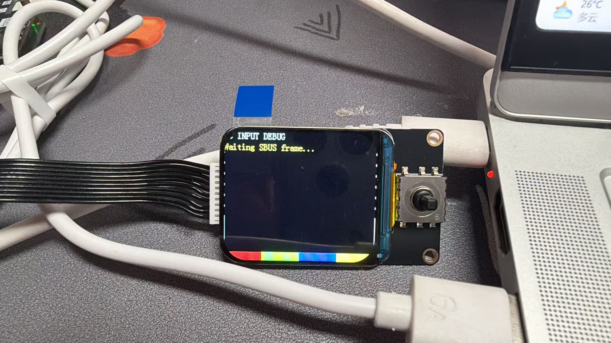

# 硬件运行基线证据

## 运行信息

| 项目 | 已确认值 |
| --- | --- |
| 日期 | 2026-08-14 |
| 仓库分支 | `feature/mcuforge-demo-infra` |
| 文档基线提交 | `dbca8f7` |
| 连接设备 | STM32 开发板、TFT、电脑 USB；无车、无电机、无遥控器 |
| 正确 USB CDC 端口 | `COM3` |
| USB 硬件 ID | `VID_0483&PID_5740` |
| 记录命令 | `python PC_Tools\telemetry_monitor.py --headless --port COM3 --duration 30 --output-dir PC_Tools\data\baseline-hardware-2026-08-14-com3` |
| 会话目录 | `PC_Tools/data/baseline-hardware-2026-08-14-com3/2026-08-14_20-34-39/`（被 `.gitignore` 忽略） |

## 串口选择过程

第一次尝试的 `COM7` 可以打开，但 30 秒内没有收到数据。其硬件 ID 为
`VID_FAED&PID_4870`，与本工程 USB 描述符声明的 `VID_0483&PID_5740`
不一致，因此不作为 STM32 CDC 证据。

`COM3` 的硬件 ID 为 `VID_0483&PID_5740`，与固件 USB CDC 描述符一致，
且能够持续输出可解析的 JSON 遥测。

## 30 秒遥测结果

| 指标 | 结果 |
| --- | --- |
| 记录时长 | 30.0 s |
| 有效样本 | 475 |
| 首个 MCU tick | 16452 ms |
| 末个 MCU tick | 46412 ms |
| MCU tick 跨度 | 29960 ms |
| 平均有效样本率 | 约 15.8 Hz |
| 状态集合 | 仅 `FAILSAFE` |
| 左右轮速 | 全部为 0 |
| 左右命令 | 全部为 0 |
| `cmd_valid` | 0 |
| `sbus_failsafe` | 1 |

本次运行只读取遥测，没有通过 CDC 向 STM32 发送控制帧，也没有烧录固件。

## 原始证据哈希

原始会话文件保留在本地忽略目录。以下哈希用于后续核验：

| 文件 | SHA-256 |
| --- | --- |
| `raw.jsonl` | `05DFC36C2EC3AC3F75D54F145F8B1F786DAE5118A6D54784400254456C471DE4` |
| `telemetry.csv` | `1DF4A483618AB212A0C4E514C2A1E7EAADAC832C638BB5D148A8E4B3E7E6D508` |
| `session_info.json` | `55BE83E2876A4D083BD0532D3B43BE6437CB86FCF29EBCFEBD236E9083E4655A` |

## TFT 照片

| 项目 | 结果 |
| --- | --- |
| 文件 | `docs/evidence/images/hardware-runtime-baseline-2026-08-14.jpg` |
| SHA-256 | `78CA1C980ABF466E22A2378293EF867F989907E423844A70F74C8C05B7EF28AE` |
| 画面 | `INPUT DEBUG` / `Waiting SBUS frame...` |
| 可证明 | TFT 初始化、背光、字体和 SPI 显示链路正在运行 |
| 不可证明 | PC 控制输入、MCUForge 虚拟输出、150 ms failsafe 或真实执行器行为 |

该画面与遥测中的 `state="FAILSAFE"`、`sbus_failsafe=1`、`cmd_valid=0`
一致。它是改造前基线，不是 MCUForge 最终界面。

## 额外发现

`motor_write_sequence` 从首样本的 222 增长到末样本的 650，左右
`*_write_fail_count` 同步增长。说明没有连接电机时，现有固件仍在运行原有
RS485 轮毂通信状态机并持续等待失败。后续 MCUForge Demo 路径需要绕开
这条状态机，使用独立的虚拟左右输出，避免真实电机查询超时影响测试节拍。

这个发现只描述软件执行路径；当前现场没有车、电机或其他 RS485 从站，
不能据此推断任何物理执行器状态。
