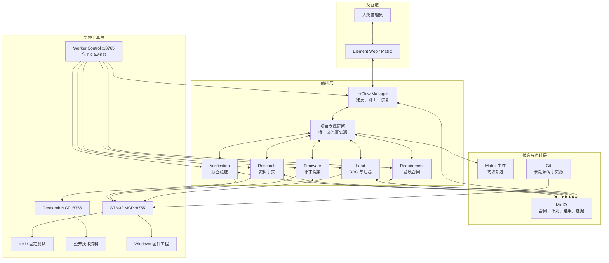
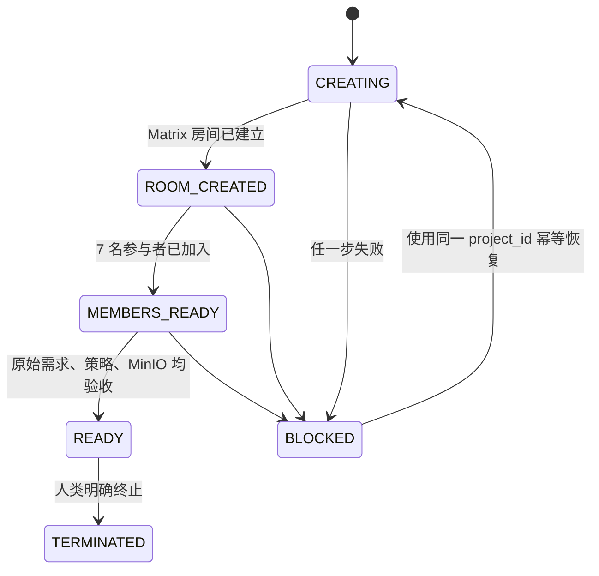
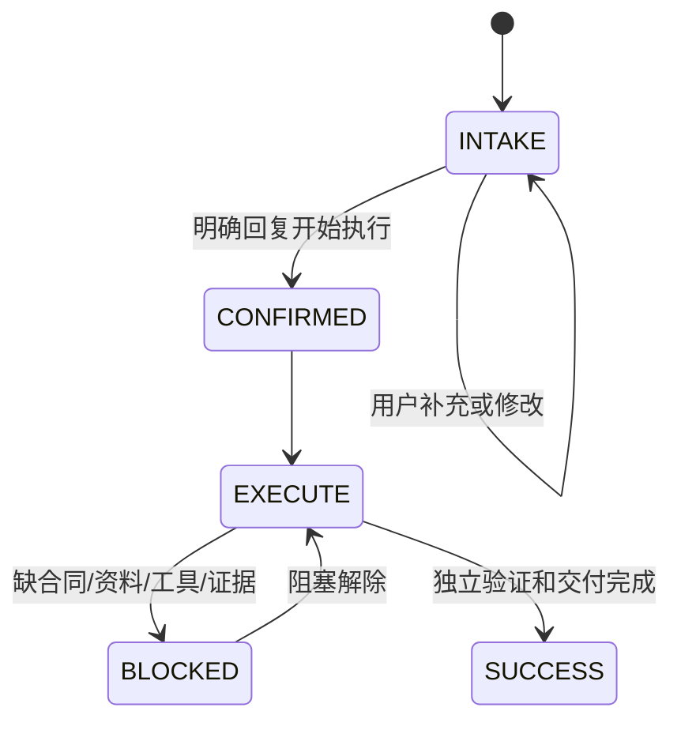

# MCUForge 系统架构

## 1. 设计目标

MCUForge 的目标不是让多个 Agent 同时聊天，而是把 MCU 研发中的责任、权限、事实源和验收拆开。系统必须同时满足：

- 需求未确认时不能编码；
- 手册结论有来源、有版本、可复用；
- 实现角色不能自行宣布验证通过；
- 工具只能操作明确工程和白名单路径；
- 长任务持续汇报真实状态；
- Worker 在线但消息失效时能够检测和恢复；
- 每个项目有唯一、可追溯的协作空间。

## 2. 逻辑架构



## 3. 组件职责

### 3.1 Human/Admin

人类决定业务目标和风险边界。以下动作默认保留人类批准：

- 确认需求草案并开始执行；
- 普通模式下应用补丁；
- 烧录和操作 COM；
- Git commit/push；
- 影响真实外部设备或账号的动作。

### 3.2 Manager

Manager 是平台级编排者，主要负责：

- 从自然语言识别“创建新项目”；
- 创建唯一项目房间并邀请全部角色；
- 保存原始请求、项目元数据和审计轨迹；
- 监听 Worker 状态并立即回执；
- Worker 无回执时按策略 restart，再必要时 recreate；
- 向用户汇总基础设施异常。

Manager 不负责写固件，也不应该替 Lead 决定验收合同。

### 3.3 Lead

Lead 管理单个研发任务的 DAG：

```text
INTAKE → CONFIRMED → CONTRACT → RESEARCH → IMPLEMENTATION → VERIFICATION → APPROVAL
```

它只负责拆解、路由和汇总。合同未冻结、资料不足、补丁未真正应用或验证证据不完整时，都不能跳到成功。

### 3.4 Requirement

把自然语言转成可测试的合同，至少包含目标、当前现象、目标行为、验收条件、非目标、修改范围、验证证据、风险和待确认问题。合同状态达到 `frozen_for_research_and_implementation` 后，后续角色才能工作。

### 3.5 Research

从官方手册、官方仓库和允许的公开技术站点收集事实。输出需包含来源 URL、版本/日期、许可证、摘录或结论、置信度和未知项。资料不足时向用户索要，不得编造寄存器、引脚或时序。

### 3.6 Firmware

通过 STM32 MCP 读取主机工程，优先新增或修改独立模块，保持 `main.c` 只做初始化和调度。它输出统一 diff 提案，不直接写主机工程，也不执行应用、提交、推送或烧录。

### 3.7 Verification

独立读取实际工作树/暂存区 diff，检查固定测试完整性，执行真实 Keil 构建并记录产物哈希。它只能给出与证据强度一致的结论：静态通过不等于构建通过，构建通过不等于硬件通过。

## 4. 三类 Bridge

### 4.1 STM32 Tool Bridge

Windows 本机 HTTP/MCP 服务，默认端口 `8765`。主要工具：

| 工具 | 用途 | 明确不做什么 |
| --- | --- | --- |
| `stm32_get_project_snapshot` | 分支、HEAD、状态和文件数 | 不 fetch、不修改 |
| `stm32_list_project_files` | 分页列跟踪文件 | 不暴露依赖和生成物 |
| `stm32_read_project_file` | 读取受限文本 | 拒绝越界、密钥和大文件 |
| `stm32_get_git_diff` | 工作树或 `cached` 暂存差异 | 不 stage/reset/commit |
| `stm32_verify_test_integrity` | 校验固定测试哈希 | 不改测试和锁 |
| `stm32_run_keil_build` | 调固定 Keil 包装器 | 不烧录、不执行任意命令 |
| `stm32_create_patch_proposal` | 校验并登记统一 diff | 不写工程源码 |
| `stm32_apply_approved_patch` | 复核后应用到工作树与 index | 不 commit/push/flash/COM |

### 4.2 Research Web Bridge

Windows 本机 HTTP/MCP 服务，默认端口 `8766`。它只允许公开 HTTPS 技术资料，包含来源白名单、查询长度、结果数、下载大小、重定向和超时限制。禁止登录、Cookie、私网、可执行文件和仓库写入。

### 4.3 Worker Control Bridge

运行在 `hiclaw-net` 内，端口 `18765`，不映射到主机。它通过严格容器名称白名单只操作五个 MCUForge Agent，提供：

1. Manager 与 Worker Matrix 白名单的持续策略守护；
2. 关闭流式 `m.replace`，确保监听器收到单条最终事件；
3. 对 Worker 机器状态立即发 `[COORDINATOR_ACK]`；
4. 精确 Worker inspect/restart/recreate API；
5. `/health` 汇总策略守护和协调 relay 状态。

它挂载 Docker socket，因此权限较高；边界依赖严格的 `mcuforge-(requirements|research|firmware|verification|lead)` 名称正则，不能扩展成任意容器控制 API。

## 5. 项目房间状态机



`READY` 的硬条件：

- `schema_version=2`；
- `interaction_mode=project_room_only`；
- `project_room_id` 存在；
- 管理员、Manager、Lead 和四个 Worker 共 7 名成员已加入；
- `[PROJECT_CREATED]` 和 `[ORIGINAL_REQUEST]` 事件存在；
- 原始来源事件、请求 SHA 和 `[PROJECT_MOVED]` 迁移通知事件均已登记；
- `meta.json`、`plan.md`、`audit.ndjson` 已同步 MinIO；
- Manager 对该房间的自动响应策略生效。

失败后必须用同一 `project_id` 重试，不能不断创建新房间掩盖问题。

## 6. 需求确认状态机



“好”“嗯”“继续”不算正式批准。执行确认和烧录/推送批准是不同权限，不能合并推断。

## 7. 数据与事实源

| 数据 | 权威事实源 | 镜像/展示 | 禁止做法 |
| --- | --- | --- | --- |
| 长期源码 | Git 仓库 | GitHub | 只放容器、不提交 |
| 固件当前状态 | Windows `ProjectRoot` + Git | STM32 MCP 快照 | 用 Worker 容器副本判断 |
| 补丁策略 | `agent_profile/patch-policy.json` | MinIO Markdown 镜像 | 用旧聊天或旧 Markdown 当门禁 |
| 项目状态 | MinIO `meta.json`/`audit.ndjson` | Matrix 中文进度 | 只看模型自述 |
| 人类交互 | 项目 Matrix 房间 | 项目摘要 | 分散到 Worker 私聊 |
| 芯片事实 | 官方资料及 Source Register | Research 摘要 | 无来源编造 |
| 构建结论 | Keil 原始日志与产物哈希 | Verification 报告 | 把静态检查说成真实构建 |

## 8. 可靠性策略

### 消息链路

Worker 的接单、同步、进度、阻塞和完成消息必须：

- 在原项目房间发送；
- 带派发者完整 Matrix ID；
- 事件中包含真实 `m.mentions.user_ids`；
- 使用单条最终事件，不依赖编辑事件；
- 30 秒内发送 `TASK_RECEIVED`。

Worker Control relay 在模型完成长 turn 前先给机器状态发送确定性回执，解决“Worker 已回复，但 Manager 要等心跳才看到”的问题。

### Worker 恢复

当 Worker 两次 30 秒无回执时，Manager 可自动执行一次 restart；仍无回执再执行一次 recreate，随后才报告用户。恢复动作必须记录 Worker、时间、原因、前后容器 ID 和最终状态，禁止无限循环。

### 策略持久化

Matrix 允许列表和非流式设置同时写入容器配置和 MinIO。Worker 重启、重建或普通配置更新后，守护进程会自动核对并修复，避免“容器在线但 Manager 与 Worker 无法通信”。

## 9. 权限边界

| 动作 | 默认权限 |
| --- | --- |
| 读取白名单工程文件 | 已授权角色可执行 |
| 查询公开技术资料 | Research/授权角色可执行 |
| 生成补丁提案 | Firmware 可执行 |
| 应用普通补丁 | 人类精确令牌后由 Lead 调用 |
| `AUTO_LOCAL` 应用/构建/固定测试 | 本次明确授权且 Bridge 开启该模式 |
| 修改固定测试/哈希 | 禁止 |
| 任意 Shell | 不提供 |
| Git commit/push | Agent 默认不提供 |
| 烧录/COM/真实执行器 | 独立人工批准且需专门工具；当前通用 Bridge 不提供 |

## 10. 当前限制

- 内置冻结 Profile 只覆盖 VCW Demo；换工程必须重新建立合同、白名单、测试哈希和工具链。
- Research Bridge 是受控公开网页读取，不是完整浏览器，也不处理登录资料。
- 当前通用 STM32 Bridge 不提供烧录和串口工具；这属于刻意安全边界，不应在文档中写成已实现。
- 硬件测试依赖实际开发板和 COM 口，无法仅靠代码包保证。
- Worker Control 使用 Docker socket，部署到生产环境前应进一步加入请求鉴权、审计持久化和最小权限代理。
- 本地 HiClaw 账号、模型供应商和 API Key 由使用者自行配置，仓库不包含可共享密钥。
